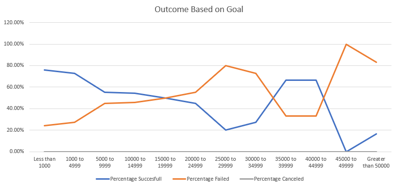

# kickstarter-analysis

## Overview of Project
In this project, we were challenged to analyze a data set of kickstarter campaigns. Lousie was trying to crowdfound her play throug kickstarter. In order to help her and increase her chances of succeding, we are going to try and identify if there is a trend between the outcome of the prohect and their goal or launch date.

### Purpose
The purpose of this project is to determine any posible trend that determines if a kickstarter project is successfull. Based on the analysis made, we should be able to determine an optimal goal and time of release, for the kickstarter campaign to suceed.

## Analysis and Challenges
After breaking up the data we have come up with 2 different analysis, comparing the outcome with their launch date or their project goal. In order to make any trend clearer to the human eye, graphs have been created to show the data in a visual matter.

### Analysis of Outcomes Based on Launch Date

- Comments: The graph demonstrates a clear uprising in succesfull projects between the months of may and june. After this, the ammount of succesfull theater projects keep falling until they are equal to ammount of projects canceled in the month of december. For failed and canceled projects, the ammount stays regularly the same. Although there is a small spike in canceled projects in the month of octobre, but nothing to shocking as the spike the successful project shows in may.
 
### Analysis of Outcomes Based on Goals

- Comments: Between the ammounts of less than 1000 and 25,000 to 29,999, the Percentage of succesfull projects has a clear negative correlation. On the other hand, the percentage of failed projects has a clear possitive correlation between the same ammounts. After this, the data behaves differently. We can attribute this to the low ammount of projects between the ranges of 35,000 to 39,999 and grater than 50,000.

### Challenges and Difficulties Encountered
The biggest challenge encountered was being able to use the countif function correctly. At first, I only used 2 sortings, the range and the outcome. I skipped the subcategory sorting, because I already had a filter in the original page, where the data came from. This led to different numbers, and of course, a different graph. In order to solve it I had to stop and review the formulas I used. I did not see my error, until I reread the instructions again. I thought "Well, if I had to input the filters in the formula for the ranges and the outcomes, why did I assumed that I could filter the subcategory in the excell sheet instead of the formula?" I then continued to input the formulas with the whole 3 filters, and manage to get it correctly. 

## Results

- When we take a look on how the outcomes behave depending of the month of their release, we can see a clear trend. The best months to publish a kickstarter campaing in the category of theater are May and June. This are the 2 months with the highest ammounts of succesfull projects. This may be pretty clear, but what other conclusion can we reach with the data? We can not only determine the best time to publish, but we can determine when we can not absolutly publish a kickstarter campaign. In the nmonth of december the ammoount of succesful and failed projects are closely the samee. There is only a difference of 2 projects between succesful and failed projects, so December is defenetly a month to avoid.
- By looking at the negative tendency the percentage of succesful projects has based on their goal, we can see that the more money we ask for, the higher our chances of failure are. The range at which the lines intercect is 15,000 to 19,999. In this range, a kikcstarter project for a play has a 50/50 chance of failing or succeeding. In order to avoid this numbers, we need to set our goal below 15,000. This will give the campaign more chances of succeeding. For a safer choice, the goal of the project should be below 5,000. With this goal, the project has more than 70% chances of being succesful. 
- The biggest limitation of this dataset is that it does not show the genre of the play the people are supporting. People might be more interesed in supporting projects they might like, so there might be certain tendencies dependning on the favorite genre of the poeple. Also, reducing the location of the kickstarter campaign to just the country might be a limitation. In cases of big countries of the US, behaviour might change depending on their zone. Maybe in the Mid-west, people like to watch more local theatre and are more likely to donate to projects that will be shown in their city. Maybe in North-Eastern side they prefer to see big productions, and are not really interested in funding small plays.
- To be added
