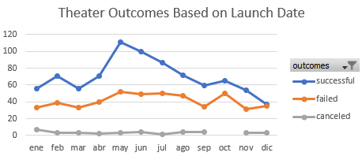

# kickstarter-analysis
Analysis based on past kickstarter campaigns. The purpose was to determine any possible trend that determined or increased the chances of succedding. 

## Overview of Project
asdfgj

### Purpose
The purpose of this project is to determine any posible trend that determines if a kickstarter project is successfull. Based on the analysis made, we should be able to determine an optimal goal and time of release, for the kickstarter campaign to suceed.

## Analysis and Challenges

### Analysis of Outcomes Based on Launch Date

